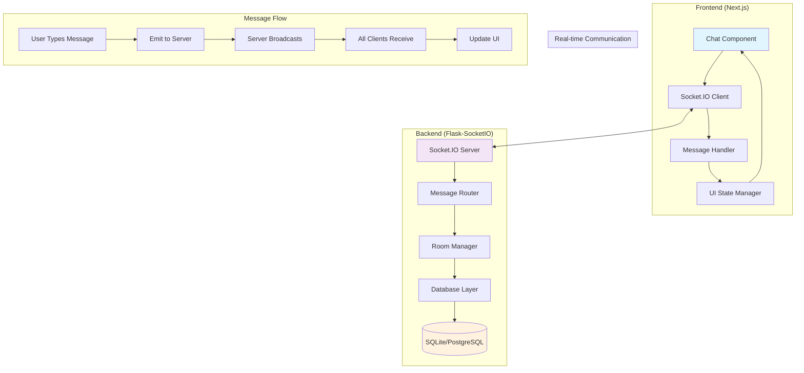
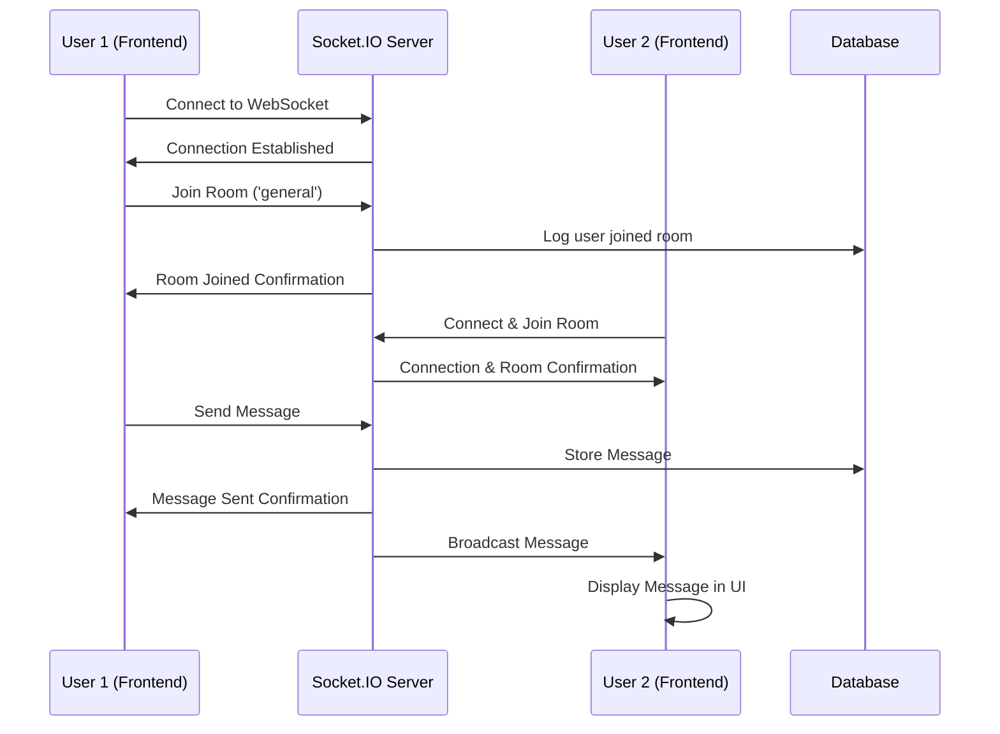

# Design Document

## Overview

This design implements real-time WebSocket communication for the Encrptalk chat application. The architecture follows a client-server model where the Next.js frontend establishes WebSocket connections to a Flask-SocketIO backend server. The server acts as a message relay, broadcasting messages to connected clients in real-time while maintaining chat room organization.

## Architecture

### High-Level Architecture Diagram



### Component Interaction Flow



## Components and Interfaces

### Frontend Components

#### 1. WebSocket Service (`/src/services/websocket.js`)
```javascript
class WebSocketService {
  connect(userId, token)
  disconnect()
  joinRoom(roomId)
  leaveRoom(roomId)
  sendMessage(roomId, message)
  onMessage(callback)
  onConnectionStatus(callback)
}
```

#### 2. Chat Hook (`/src/hooks/useChat.js`)
```javascript
const useChat = (roomId) => {
  // Returns: { messages, sendMessage, connectionStatus, isConnected }
}
```

#### 3. Enhanced Chat Component (`/src/app/page.js`)
- Integrates WebSocket service
- Manages real-time message display
- Handles connection status UI

### Backend Components

#### 1. Socket Handler (`/backend/services/messaging/socket_handler.py`)
```python
class SocketHandler:
    def handle_connect(auth_data)
    def handle_disconnect()
    def handle_join_room(room_data)
    def handle_leave_room(room_data)
    def handle_message(message_data)
```

#### 2. Room Manager (`/backend/services/messaging/room_manager.py`)
```python
class RoomManager:
    def add_user_to_room(user_id, room_id)
    def remove_user_from_room(user_id, room_id)
    def get_room_users(room_id)
    def broadcast_to_room(room_id, message)
```

## Data Models

### Message Model (Enhanced)
```python
class Message(db.Model):
    id = db.Column(db.Integer, primary_key=True)
    sender_id = db.Column(db.Integer, db.ForeignKey('user.id'))
    room_id = db.Column(db.String(50), nullable=False)
    content = db.Column(db.Text, nullable=False)  # Plain text for now
    message_type = db.Column(db.String(20), default='text')
    timestamp = db.Column(db.DateTime, default=datetime.utcnow)
```

### Room Model (New)
```python
class Room(db.Model):
    id = db.Column(db.String(50), primary_key=True)
    name = db.Column(db.String(100), nullable=False)
    created_by = db.Column(db.Integer, db.ForeignKey('user.id'))
    created_at = db.Column(db.DateTime, default=datetime.utcnow)
    is_active = db.Column(db.Boolean, default=True)
```

## WebSocket Events

### Client to Server Events
- `connect` - Establish connection with authentication
- `join_room` - Join a specific chat room
- `leave_room` - Leave a chat room
- `send_message` - Send message to room
- `disconnect` - Clean disconnect

### Server to Client Events
- `connected` - Connection confirmation
- `room_joined` - Room join confirmation
- `room_left` - Room leave confirmation
- `new_message` - Incoming message broadcast
- `message_sent` - Message send confirmation
- `connection_error` - Connection/authentication errors

## Error Handling

### Connection Errors
- **Network Issues**: Automatic reconnection with exponential backoff
- **Authentication Failures**: Redirect to login with error message
- **Server Unavailable**: Show offline mode with retry option

### Message Errors
- **Send Failures**: Show retry button with error indicator
- **Invalid Messages**: Client-side validation before sending


## Security Considerations

### Authentication
- Firebase token validation on WebSocket connection


## Deployment Considerations

### Environment Configuration
- WebSocket server URL configuration
- CORS settings for cross-origin requests
- SSL/TLS for secure WebSocket connections (WSS)
