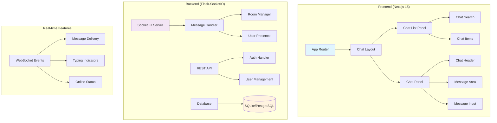
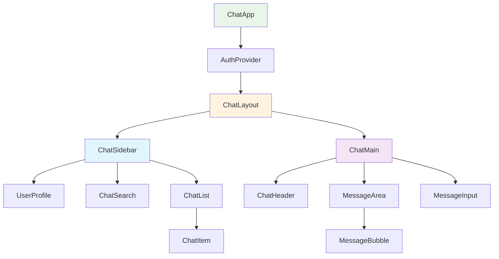

# Design Document

## Overview

This design transforms the existing chat application into a production-ready messaging platform with a clean WhatsApp-like interface. The focus is on essential functionality: reliable authentication, modern UI, real-time messaging, and proper routing. The architecture builds upon the existing Flask-SocketIO backend and Next.js frontend while introducing a cleaner component structure and better user experience.

## Architecture

### High-Level System Architecture



### Component Structure



## Components and Interfaces

### Frontend Components

#### 1. Main Layout (`/src/app/chat/layout.js`)
```javascript
const ChatLayout = ({ children }) => {
  // Responsive two-panel layout
  // Handles mobile/desktop breakpoints
  // Manages global chat state
}
```

#### 2. Chat Sidebar (`/src/components/ChatSidebar.js`)
```javascript
const ChatSidebar = () => {
  // User profile section
  // Chat search functionality
  // Chat list with unread counts
  // Online status indicators
}
```

#### 3. Chat Main (`/src/components/ChatMain.js`)
```javascript
const ChatMain = () => {
  // Chat header with contact info
  // Message area with real-time updates
  // Message input with typing indicators
  // Connection status display
}
```

#### 4. Enhanced Message Components
```javascript
const MessageBubble = ({ message, isOwn }) => {
  // Message content with proper styling
  // Timestamp and status indicators
  // Sender information for group chats
}

const MessageInput = ({ onSend, isConnected }) => {
  // Text input with send button
  // Typing indicator emission
  // Message queuing when offline
}
```

### Backend Components

#### 1. Enhanced Socket Handler (`/backend/services/messaging/socket_handler.py`)
```python
class SocketHandler:
    def handle_connect(self, auth_data)
    def handle_disconnect(self)
    def handle_join_room(self, room_data)
    def handle_send_message(self, message_data)
    def handle_typing_start(self, room_data)
    def handle_typing_stop(self, room_data)
    def handle_get_chats(self, user_id)
```

#### 2. User Presence Manager (`/backend/services/presence/presence_manager.py`)
```python
class PresenceManager:
    def set_user_online(self, user_id)
    def set_user_offline(self, user_id)
    def get_online_users(self, room_id)
    def broadcast_presence_update(self, user_id, status)
```

## Data Models (Simplified)

### Enhanced User Model
```python
class User(db.Model):
    id = db.Column(db.Integer, primary_key=True)
    firebase_uid = db.Column(db.String(128), unique=True, nullable=False)
    email = db.Column(db.String(120), unique=True, nullable=False)
    display_name = db.Column(db.String(100), nullable=False)
    avatar_url = db.Column(db.String(255))
    last_seen = db.Column(db.DateTime, default=datetime.utcnow)
    is_online = db.Column(db.Boolean, default=False)
    created_at = db.Column(db.DateTime, default=datetime.utcnow)
```

### Enhanced Message Model
```python
class Message(db.Model):
    id = db.Column(db.Integer, primary_key=True)
    sender_id = db.Column(db.Integer, db.ForeignKey('user.id'), nullable=False)
    room_id = db.Column(db.String(50), nullable=False)
    content = db.Column(db.Text, nullable=False)
    message_type = db.Column(db.String(20), default='text')
    
    # Encryption fields (existing)
    encrypted_aes_key = db.Column(db.Text)
    iv = db.Column(db.String(32))
    is_encrypted = db.Column(db.Boolean, default=False)
    
    # Status tracking
    status = db.Column(db.String(20), default='sent')  # sent, delivered
    delivered_at = db.Column(db.DateTime)
    
    timestamp = db.Column(db.DateTime, default=datetime.utcnow)
    
    # Relationships
    sender = db.relationship('User', backref='sent_messages')
```

### Chat Room Model
```python
class Room(db.Model):
    id = db.Column(db.String(50), primary_key=True)
    name = db.Column(db.String(100), nullable=False)
    room_type = db.Column(db.String(20), default='direct')  # direct, group
    created_by = db.Column(db.Integer, db.ForeignKey('user.id'))
    is_active = db.Column(db.Boolean, default=True)
    last_activity = db.Column(db.DateTime, default=datetime.utcnow)
    created_at = db.Column(db.DateTime, default=datetime.utcnow)
    
    # Relationships
    creator = db.relationship('User', backref='created_rooms')
```

## User Interface Design

### Desktop Layout (≥768px)
```
┌─────────────────────────────────────────────────────────────┐
│ Header Bar                                                  │
├─────────────┬─────────────────────────────────────────────┤
│             │                                             │
│  Sidebar    │           Chat Panel                        │
│  (320px)    │           (flex-1)                          │
│             │                                             │
│ ┌─────────┐ │ ┌─────────────────────────────────────────┐ │
│ │Profile  │ │ │ Chat Header (Contact, Status)           │ │
│ └─────────┘ │ ├─────────────────────────────────────────┤ │
│ ┌─────────┐ │ │                                         │ │
│ │Search   │ │ │        Message Area                     │ │
│ └─────────┘ │ │                                         │ │
│ ┌─────────┐ │ │ - Message Bubbles                       │ │
│ │Chat 1   │ │ │ - Timestamps                            │ │
│ │Chat 2   │ │ │ - Status Indicators                     │ │
│ │Chat 3   │ │ │                                         │ │
│ └─────────┘ │ ├─────────────────────────────────────────┤ │
│             │ │ Message Input + Send Button             │ │
│             │ └─────────────────────────────────────────┘ │
└─────────────┴─────────────────────────────────────────────┘
```

### Mobile Layout (≤767px)
```
Chat List View:
┌─────────────────────────────────────┐
│ Header (Profile, Search)            │
├─────────────────────────────────────┤
│ Search Bar                          │
├─────────────────────────────────────┤
│                                     │
│ Chat Item 1 [Unread: 2]            │
│ Chat Item 2                         │
│ Chat Item 3 [Unread: 1]            │
│                                     │
└─────────────────────────────────────┘

Chat View:
┌─────────────────────────────────────┐
│ Header (← Back, Contact Name)       │
├─────────────────────────────────────┤
│                                     │
│        Message Area                 │
│                                     │
│ Message Bubble (Received)           │
│     Message Bubble (Sent) ✓✓       │
│ Message Bubble (Received)           │
│                                     │
├─────────────────────────────────────┤
│ [Type a message...] [Send]          │
└─────────────────────────────────────┘
```

## WebSocket Events (Essential)

### Client to Server Events
- `connect` - Establish connection with authentication
- `join_room` - Join a specific chat room
- `send_message` - Send message to room
- `typing_start` - Start typing indicator
- `typing_stop` - Stop typing indicator
- `get_chats` - Get user's chat list
- `disconnect` - Clean disconnect

### Server to Client Events
- `connected` - Connection confirmation
- `room_joined` - Room join confirmation with message history
- `new_message` - Incoming message broadcast
- `message_delivered` - Message delivery confirmation
- `typing_indicator` - User typing status
- `user_online` - User came online
- `user_offline` - User went offline
- `chat_list` - User's chat list with unread counts

## Routing Structure

### URL Routes
```
/ - Redirects to /chat or /login
/login - Authentication page
/chat - Main chat interface (shows chat list on mobile)
/chat/[roomId] - Specific chat conversation
```

### Navigation Implementation
```javascript
// Next.js App Router structure
app/
├── page.js (redirect logic)
├── login/
│   └── page.js
└── chat/
    ├── layout.js (chat layout wrapper)
    ├── page.js (chat list/default view)
    └── [roomId]/
        └── page.js (specific chat)
```

## Security & Performance

### Authentication
- Firebase Authentication with Google OAuth
- JWT token validation on WebSocket connections
- Secure session management
- Automatic token refresh

### Performance Optimizations
- Message pagination (load 50 messages initially)
- Virtual scrolling for large chat lists
- Debounced search and typing indicators
- Connection pooling and efficient WebSocket management
- Image optimization and lazy loading

### Error Handling
- Global error boundaries in React
- Graceful WebSocket reconnection
- User-friendly error messages
- Offline message queuing
- Connection status indicators

## Production Deployment

### Environment Configuration
```env
# Frontend (.env.local)
NEXT_PUBLIC_FIREBASE_CONFIG=...
NEXT_PUBLIC_WEBSOCKET_URL=wss://your-domain.com

# Backend (.env)
FLASK_ENV=production
DATABASE_URL=postgresql://...
FIREBASE_CREDENTIALS=...
SECRET_KEY=...
```

### Security Headers
- HTTPS/WSS enforcement
- CORS configuration
- Content Security Policy
- Rate limiting on API endpoints
- Input validation and sanitization

### Monitoring
- Error logging with structured logs
- Performance monitoring
- WebSocket connection tracking
- Database query optimization
- Health check endpoints